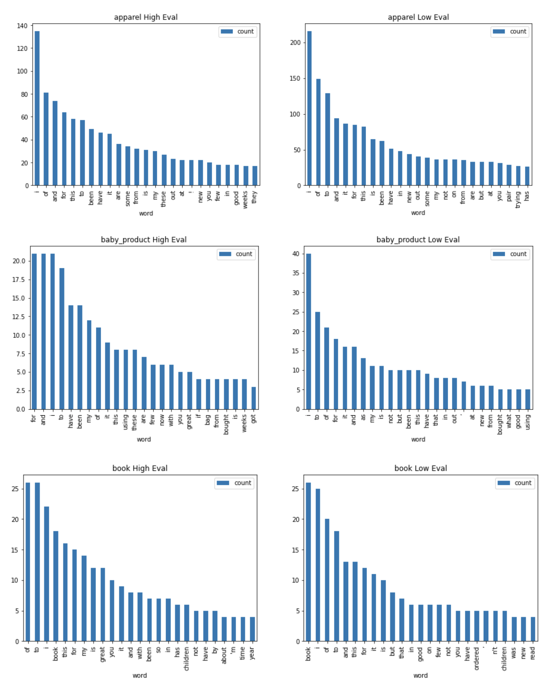

## 課題4
Amazonレビュー(英語)を製品カテゴリーごとに要約を作成して、レビュー評価の高いもの、低いものに分けて、それぞれの要約のトークン頻度を評価の高いもの、低いもので可視化し、傾向をつかむ

### [make_summary.ipynb](./make_summary.ipynb)
transformersでAmazonレビュー(英語)の要約をtxt出力する

### [AITraining4.ipynb](./AITraining4.ipynb)
Amazonレビュー(英語)を製品カテゴリーごとに要約を作成して、レビュー評価の高いもの、低いものに分けて、それぞれの要約のトークン頻度を評価の高いもの、低いもので可視化する
製品カテゴリーは30個、レビュー評価は4以上が高いとしている

### 推論結果

レビューが低いものには、**not**や**but**が多い気がする

※ 以下のグラフの製品カテゴリーは3つを抜粋