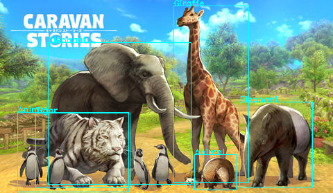

## 課題5
Google CloudにAPIを投げてみよう
オブジェクト検出、Speech to TextのAPIを使ったスクリプト

### [object_localization.py](./object_localization.py)
Vision APIを使って、ある動物の画像からラベルとして動物の種類とオブジェクト境界線が記載された画像を作成する

### [text_detection.py](./text_detection.py)
Vision APIを使って、ある名刺の画像から文字列と文字列境界線が記載された画像を作成する

### [speech_to_text.py](./speech_to_text.py)
リアルタイムに音声をテキストとして標準出力する

### 実行結果
* 動物の検出結果(object_localization.py)


* 名刺の文字列抽出(text_detection.py)  
読み込んだ画像

文字列抽出結果
    ```
    K-1 PRINT
    営業部 第一販売課
    名刺 太郎
    Taro Meishi
    株式会社ケイワンプリント
    〒160-0023 東京都新宿区西新宿7-2-6 西新宿K-1ビル7F
    TEL 03-3369-7120 FAX 03-3369-7127 Mobile 090-0000-0000
    E-mail:info@k1-print.co.jp
    URL:http://www.kl-print.co.jp
    ```
* 音声->テキスト出力(speech_to_text.py)
  
※ 上の動画では声出してます