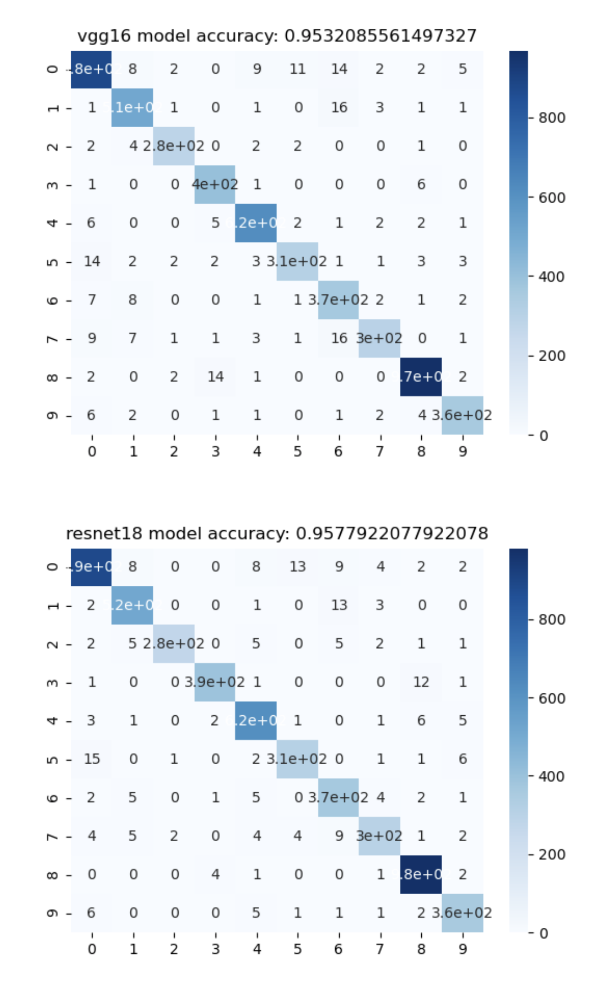

## 課題8
Animal10の画像分類をResNet18とVGG16のfine tuningを行い、両者の学習モデルを作成する  
その学習モデルから推論結果を取得し、評価、考察する

### [compare_models.py](./compare_models.py)
Animal10の画像分類をResNet18とVGG16のfine tuningを行い、両者の学習モデルを作成する

### [show_diff.py](./show_diff.py)
ResNet18とVGG16から作成した学習モデルの推論結果を取得する

### [AITraining8.ipynb](./AITraining8.ipynb)
学習データの展開、compare_models.pyの実行、show_diffの実行をSageMaker Notebookインスタンス上で行うコマンド

### [diff_result](./diff_result)
ResNet18とVGG16とで推論結果が異なる画像を格納
データ数100までのものだけ画像出力している

### 考察結果
ResNet18とVGG16との推論結果の違いを考察する

#### Confusion Matrixと精度の考察

ResNet18もVGG16もほぼ同じ精度。Animal10だと両者に差はないことがわかった

#### 両者で推論結果が異なるものの比較

ResNet18の場合は、リスを猫に間違えていたり、犬を馬に間違えていたりとかなり惜しい。VGG16は羊を象に間違えていたりと割と適当だなと感じた。そこはResNet18の方が多層構造であるため優れているからなのかも